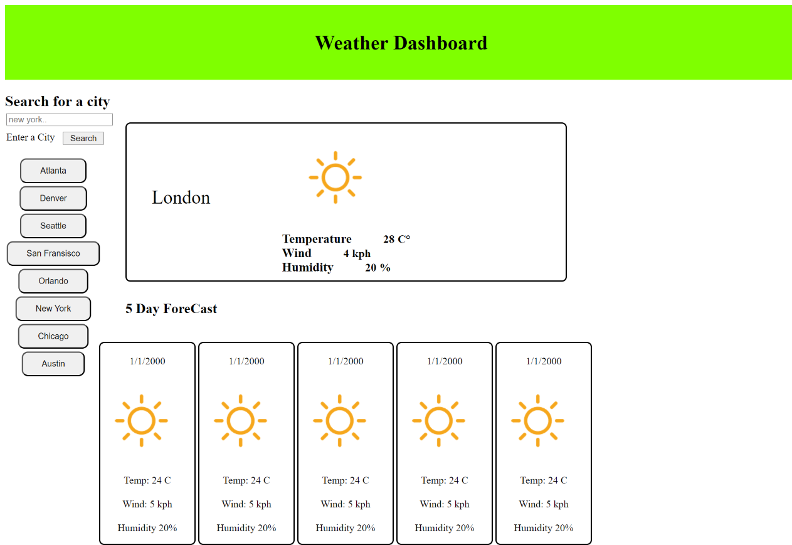

## Weather App Project
# The Weather App

Check the weather around you and all over the cities in the world at a glance. Rely on the accurate weather forecast and adjust your schedule to the weather coming in. You won’t even have to look out the window as the app will make you feel like you are already outside!

Weather is sometimes difficult to predict. This accurate weather app allows to find out a detailed forecast wherever you are, for any time of the day by tapping on the icons: With the Use of the free open weather API I was able to plan out and build an app that will offer the user current weather and forecast for different locations

<li>City Name</li>
<li>Current  temperature</li>
<li>Wind Speed</li>
<li>Humidity</li>
<li>Date</li>

## Click here for a demonstration

https://tocopro.github.io/Weather_App_Project/

## The Image of the App front page

## The GIF of the functionality of the app

[Title](<../Downloads/Untitled_ Jul 26, 2023 8_35 PM.webm>)
"C:\Users\nicwa\Weather_App\Untitled_ Jul 26, 2023 8_35 PM.webm"

